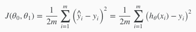
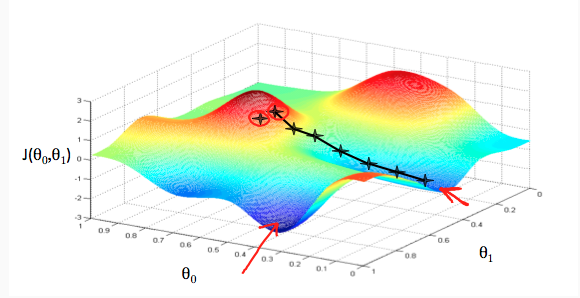
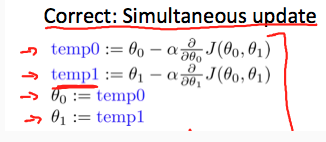

# 1주차 인트로
머신러닝이란 분명한 프로그래밍 없이 컴퓨터에게 학습할 수 있는 능력을 부여하는 것  

### 보다 추상적인 수준의 명령을 내리는 것이라고 이해  

기존 프로그래밍: 문제를 해결하는 알고리즘을 다 짜서 사람 대신 컴퓨터가 계산만 함  
머신러닝: 문제의 해결 방법 자체를 학습을 통해 발견, 사람은 학습 데이터와 작업, 측정 기준만을 제공

실생활의 복잡한 문제들은 방대한 데이터들이 복잡한 방식으로 측정하고자 하는 결과값에 영향을 주는데  
이런 문제는 사람이 데이터를 종합해서 해결 알고리즘을 발견하는 것이 어렵다 때문에 머신 러닝으로 해결할 수 있다

## Supervised and Unsupervised
supervised: 입력과 출력이 매핑되어있음  
  
* 선형 회귀: 연속 변수들일 때 이용  
* 분류: 이산 변수일 때 이용

unsupervised: 입력이 출력에 어떤 영향을 끼치는지 알 수 없는 경우

## Cost Function
가설의 정확도를 비용함수를 이용해 측정할 수 있다  
  
데이터 쌍을 x, y라고 한다  
가설함수(h)에 x를 대입해 나온 결과값과 y값의 차를 구한다  
제곱(부호를 전부 + 로 만들어주기 위해)하고 모두 더한다  
데이터의 갯수로 나누고 1/2를 곱한다  
1/2를 곱하는 것은 제곱으로 인한 데이터 뻥튀기를 줄이려는 의도인 것으로 보임  

대략 실제 데이터와 가설간 차이의 평균을 구함  

이 차이가 0이 되는게 이상적인 목표

## Gradient Descent
각 파라미터 값과 그에 대한 비용함수의 값으로 그래프를 그린다   
  
비용함수를 매번 각 파라미터 값에 대해 편미분한다  
미분값에 정해진 상수(알파)를 곱하고 원래 값에서 뺀 값을 새 파라미터로 사용한다  
다만 모든 계산은 동시에 이루어져야 한다(동일한 단계에서 계산된 값은 한번에 바뀌어야 함)  
비용함수의 미분이 0이 될때까지 계속 반복해 지역적 최솟값을 찾는다  

  
* 미분값에 곱하는 정해진 상수(알파)는 적절하게 선택되어야 함  
너무 크면 최솟값을 찾을 수 없고 작으면 시간이 오래걸림

미분이 0이 되었을 때 계산을 멈추기 때문에 지역적 최솟값이 전체 최솟값이 아닐 수도 있다