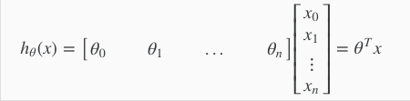
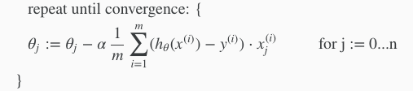
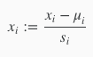
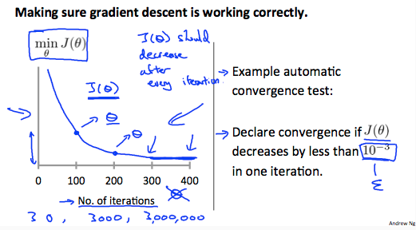
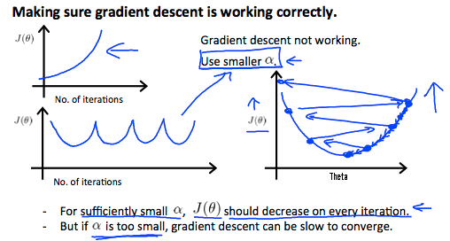
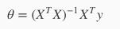

# 2주차 Linear Regression with Multiple Variables

1주차에서는 단순한 1차 함수를 가지고 계산했는데 이제부터는 인풋이 다수일 경우를 가정하고 식을 일반화 함

## Multiple Features
가설함수 h(x)의 feature를 임의의 n까지로 일반화한다  
모든 파라미터 theta의 묶음을 벡터로 만들어 벡터 theta라고 한다  
모든 x(n)들을 모아 벡터로 만들어 벡터 x라 한다  
이것을 theta’ * X 라는 행렬식으로 간단히 나타낸다  

## Gradient Descent 식 일반화

cost function을 미분한 것이다

## Feature Scaling
한 종류의 feature가 너무 큰 단위를 가질 경우(십만이나 만 단위의 숫자)  
크기를 전체적으로 동일하게 조절하면  
학습의 결과는 그대로 유지하면서 숫자가 작아지기 때문에  
gradient descent 시 속도를 올려준다  
보통 feature scaling와 mean normalization 두 가지 방법을 적용하는데  
feature scaling: 변수를 변수의 범위(변수 최댓값 - 최솟값)으로 나눈다  
mean normalization: 변수의 평균을 뺀다

  
(변수 - 평균) / 범위

## Learning Rate
gradient descent 알파값 정하기  
gradient descent를 반복하면 cost function의 크기가 줄어드는데  
x 축을 반복 횟수 y 축을 cost function 크기로 하여 그래프를 그려보면 알파값의 적절성을 따져볼 수 있다  

cost가 완만하게 줄어들 경우(알파가 너무 작을 경우): 알파값을 좀 더 크게 해서 cost가 급격하게 줄어들도록 해야한다  
왜냐 하면 알파값이 너무 작으면 시간이 오래 걸리기 때문이다  
시간은 중요한 리소스다  

cost가 발산할 경우(알파가 너무 클 경우): 알파값이 너무 크면 0이 되는 값을 찾을 수가 없다

  
알파값을 초기에 적절하게 설정하는 방법을 배우려고 했지만 그런 마법은 없음  
때문에 나름의 범위를 가지고 gradient descent를 지속 적용하면서 결과값을 보는게 가장 좋은 것 같다.

## Features and Polynomial Regression
모든 데이터를 컴퓨터에 다 넣으려 하지 말고  
그 전에 데이터를 스스로 읽고 중복되거나 줄일 수 있는 feature를 재정의 하는 것도 중요하다.  
  
상식적으로 가설 함수를 설정해야한다  
모든 x 의 차수가 1이면 커브가 있는 데이터에 fit하게 맞지 않을 수 있고  
이럴때는 가설 함수의 차수를 수정해 주면 된다

## Normal Equation
Gradient Descent는 비용 함수를 최소화 하는 방법 중 하나이다  
다른 방법으로 Normal Equation이 있다  
이 방법은 반복 없이 최적화된 theta를 찾는다  
  
시간 복잡도가 O (n3)이기 때문에 feature의 갯수가 많으면 매우 느려진다