# 3주차 Logistic Regression
분류는 linear regression과 비슷하지만 linear한 함수로는 분류할 수 없다  
## Hypothesis Representation
분류에서는 결과값이 1 과 0 사이가 되어 분류하려는 값이 그룹에 속하는지(y = 1) 속하지 않는지(y = 0) 나타내어야 한다  
0 <= h(x) <= 1 로 만들기 위해 Sigmoid Function을 사용한다  
파라미터와 인풋을 곱한 기존의 가설함수를  
y값이 0과 1 사이인 sigmoid 함수에 넣어 분류한다  
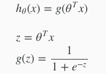  

* sigmoid 함수의 범위  
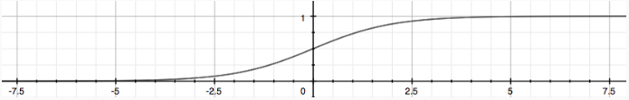

그렇게 나온 결과값은 x가 해당 클래스(y = 1)일 확률을 뜻한다  
확률이기 때문에 해당 클래스일 확률과 아닐 확률을 더했을 때 값은 1이다

## Decision Boundary
sigmoid에서 나온 값을 가지고 1과 0으로 분류하기 위해 아래와 같이 정한다  
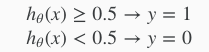  

위 그림 sigmoid 함수의 범위를 보면 sigmoid 함수에서는 0 <= x 일 때 0.5 <= y 이다

최적의 파라미터 theta 값을 구했을 때 theta' * x 이 0보다 같거나 커야 sigmoid의 값이 0.5 보다 같거나 커지게 되고 분류가 1이 된다  
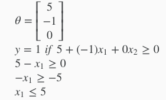  
위와 같은 예시가 있을 때 boundary는 x1 = 5 직선을 기준으로 나뉘어진다

## Cost Function and Gradient Descent
분류 문제에서 cost는 y = 1 일 때 y = 0 일 때 다르게 나타난다  
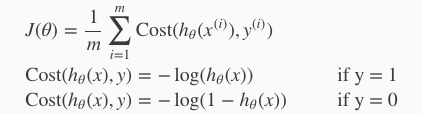  

* y = 1 cost 그래프  
h(x) = 0 일 때 무한대로 발산한다  
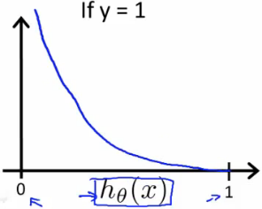  

* y = 0 cost 그래프  
h(x) = 1 일 때 무한대로 발산한다  
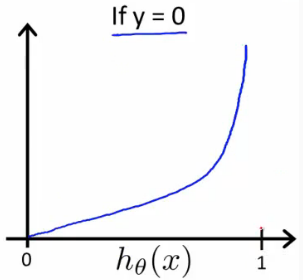

* 정리  
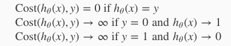

### 식으로 정리
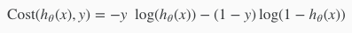

* 이를 이용한 비용함수  
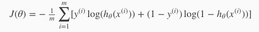

* 비용함수를 각 파라미터 theta로 편미분한 Gradient Descent  
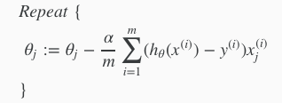

##Multiclass Classification
클래스가 세개 이상일 때, 세 가지 이상의 종류로 분류해야할 때

'분류 대상 데이터 vs 나머지'로 구분해서 각 데이터 별로 logistic regression을 학습시킨다  

데이터가 어느 클래스에 속해있는지 알아내기 위해서 학습된 모델을 사용할 때  
클래스 별로 존재하는 모든 classifier에 그 데이터를 입력해서 가장 큰 결과값을 선택한다  
가장 큰 결과값 y는 클래스에 속할 확률이 가장 크다는 것을 뜻하므로 데이터가 해당 클래스에 속한다고 볼 수 있다  
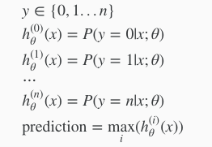